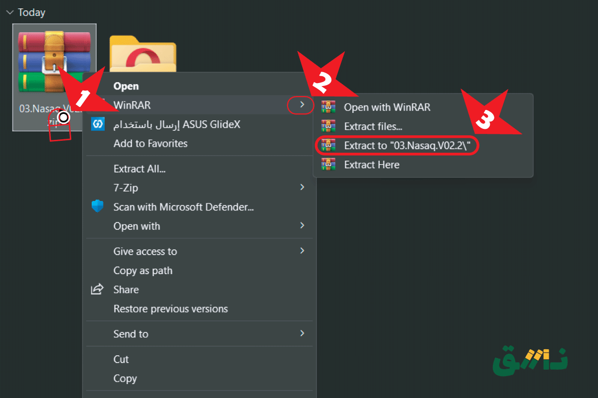
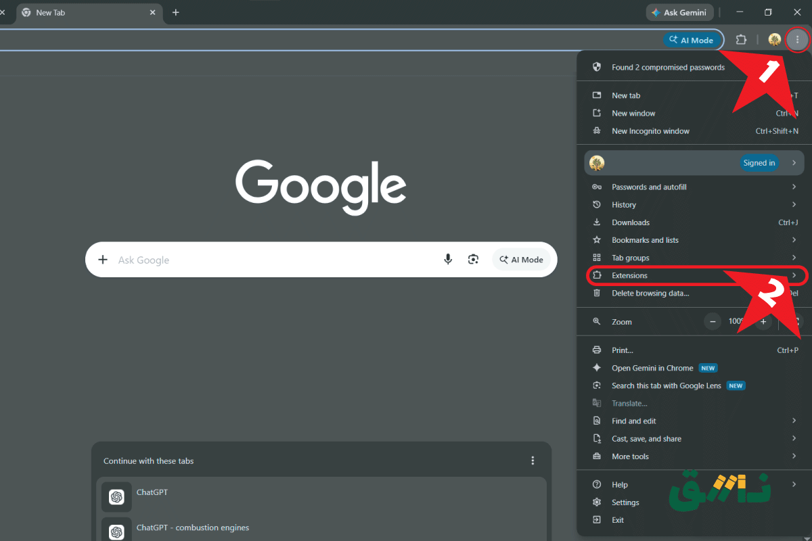
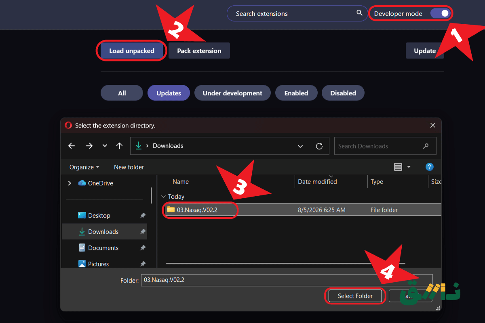
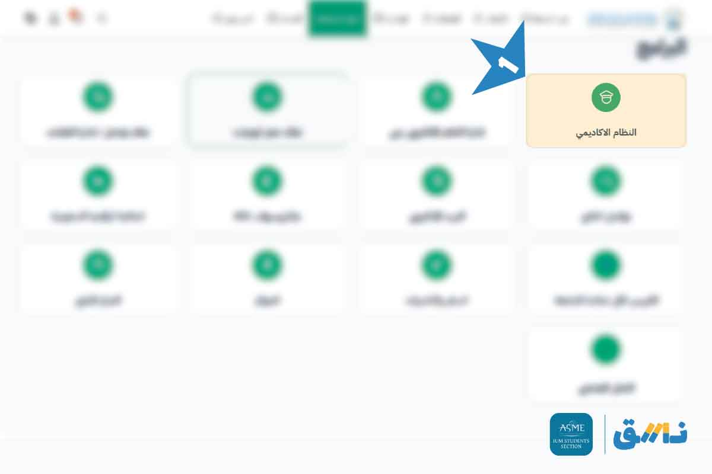
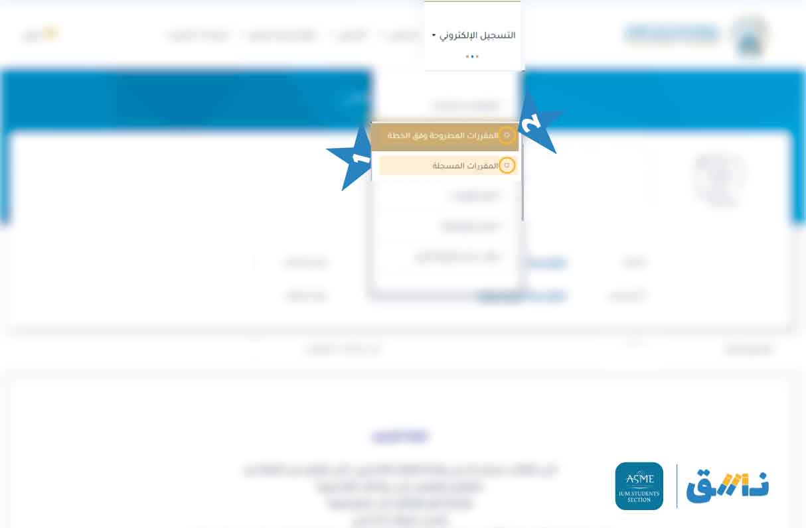
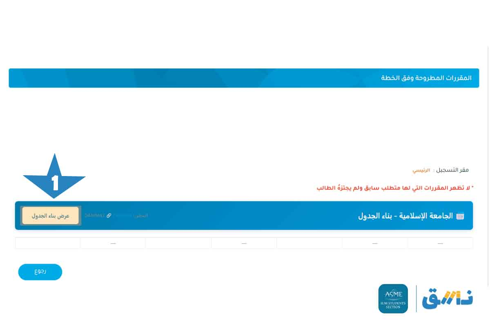
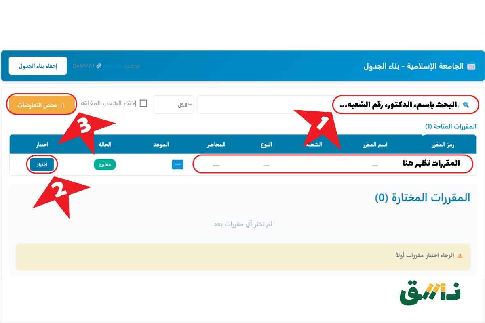
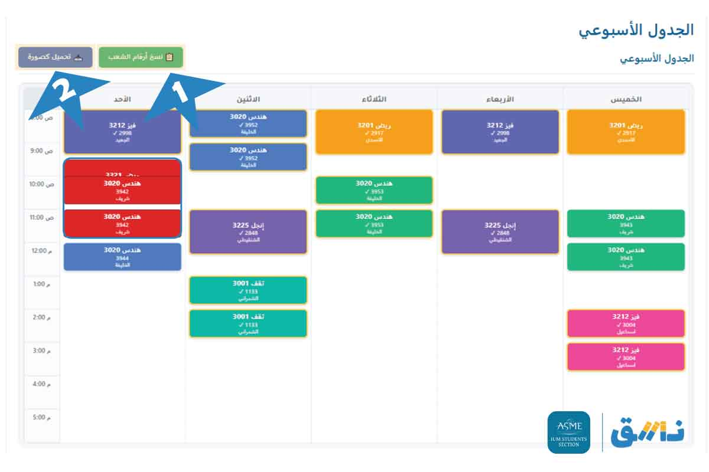

<div align="center">
	
</p>
  
</p>
<h1>نسق - رتب جدولك</h1> 

[![Chrome Download][WebStoreChrome]][DownloadChromeExt]
[![GitHub Download][WebStoreGitHub]][DownloadZip]

</div>

نسق هي إضافة ذكية لتنظيم الجداول الدراسية، تتيح إنشاء جدول افتراضي، مقارنة الشعب، واكتشاف التعارضات بسهولة قبل فتح فترة حذف وإضافة الشعب.

# تثبيت
</details>
<details dir="rtl">
<summary style="font-size: 20px; font-weight: bold;">
للكمبيوتر
</summary>


## تثبيت على الكمبيوتر

1) قم بتنزيل الإضافة من [هنا][DownloadZip]
2) قم بفك ضغط ملف ZIP داخل المجلد

<p align="center">

<br><br>
</div>

3) افتح المتصفح:
  -  ثم اضغط على 3 النقاط الموجودة في أعلى اليمين ثم اختر اختر الإضافات (Extensions)

<p align="center">

<br><br>
</div>

  -  أو يمكنك فتح صفحة الإضافات مباشرة بنسخ الرابط التالي ولصقها في شريط [البحث](chrome://extensions):

```sh
	"chrome://extensions/"
```
   - أو استخدم الاختصار:
 
```sh
	"Ctrl + Shift + E"
```
 4)  تحميل ملف الاضافة الى المتصفح: 
-  فعّل خيار وضع المطور (Developer Mode) 
- ثم اختر تحميل إضافة غير مضغوطة (Load unpacked)
- ثم اختر المجلد الذي قمت بفك ضغطه (Select Folder)

<p align="center">

<br><br>
</div>


</details>


</details>
<details dir="rtl">
<summary style="font-size: 20px; font-weight: bold;">
للهاتف
</summary>

حمل اضافة من [هنا][DownloadFierfoxeExt]
</details>


## طريقة الاستخدام

افتح موقع الجامعة من [هنا](https://sso.iu.edu.sa/Account/Login)
- توجه الى اكاديمي > التسجيل الإلكتروني > المقررات المسجلة
- ثم التسجيل الإلكتروني >  المقررات المطروحة وفق الخطة
<p align="center">


<br><br>
</div>

اختار بناء جدول:

<p align="center">

<br><br>
</div>

انشاء جدول افتاضي من مقرراتك:
- استخدم خانة البحث للبحث عن المقرر
- انقر على اختيار لاضافة المقرار الى الجدول
- اضغط فحص التعارضات لانشاء الجدول
   ملاحظة:
   اذا لم تظهر مقرراتك تلقائياً اذهب الى المقررات المسجل ثم عد االى نفس الصفحه 

<p align="center">

<br><br>
</div>


نسخ وتحميل الشعب والجدول الذي تم انشاءه
- للنسخ ارقم الشعب مع اسماء الدكاترة والوقت على شكل نص اختر نسخ ارقام الشعب
- لتحميل الجدول كاصوره اختر تحميل كاصوره
<p align="center">

<br><br>
</div>


## ملاحظات مهمة:
- الإضافة تعمل فقط على موقع الجامعة الإسلامية.
- الاضافة عمال تطوعي  غير رسمية تم انشائه لمساعده الطلاب في تنظيم وترتيب جدولهم.
--- 


<p align="right" dir="rtl">
<a href="./privacy.html">
Privacy Policy
</p>

<p align="center" dir="rtl">
  <strong>الدعم الفني:</strong>
  <a href="mailto:abdammaj@gmail.com">Gmail</a>
  |
  <a href="https://www.linkedin.com/in/abdulrahman-dammaj-31b058289">LinkedIn</a>
</p>

<p align="center" dir="rtl">
الإصدار: V2.1 
</p>

<!-- icon -->

[WebStoreChrome]: https://img.shields.io/badge/Chrome-Extensions-blue?logo=googlechrome
[WebStoreGitHub]: https://img.shields.io/badge/GitHub-Download-orange?logo=github

<!-- link -->

[linkedin]: https://www.linkedin.com/in/abdulrahman-dammaj-31b058289
[WebIu]: https://sso.iu.edu.sa/Account/Login
[ChromeExt]: chrome://extensions


<!-- Download -->

[DownloadZip]: https://github.com/Dammaj-iu/IU-Schedule/releases/download/V2.2/03.Nasaq.V02.2.zip
[DownloadChromeExt]: https://chromewebstore.google.com/detail/fnnaiebclbohpfcnngdlngcnpjjcailj?utm_source=item-share-cb
[DownloadFierfoxeExt]: https://addons.mozilla.org/en-GB/firefox/addon/نسق-رتب-جدولك/
<!-- Related pages -->

