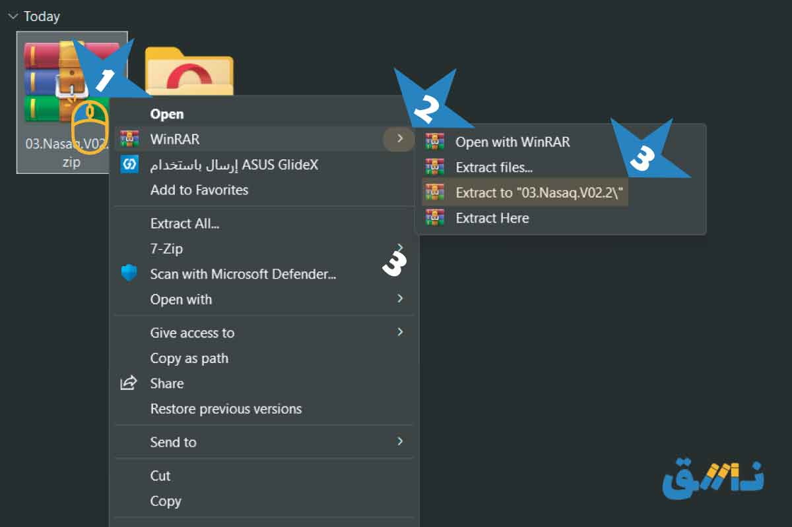
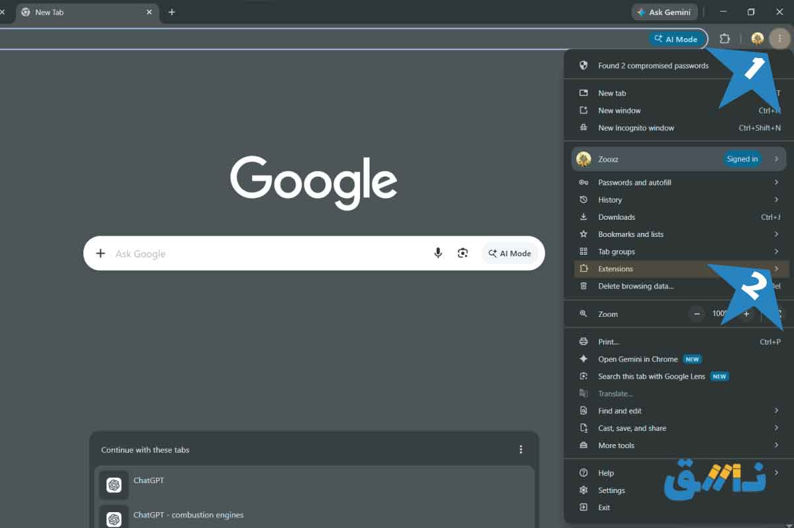
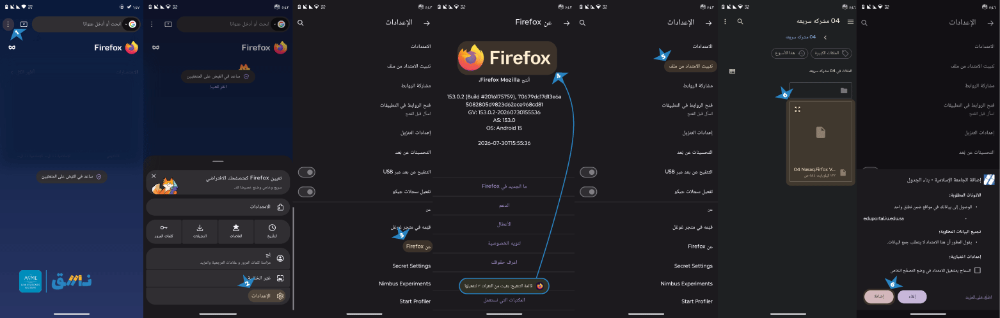

<div align="center">

[عربي](./README.md) | English

</div>

<div align="center">

</p>
 
</p>
<h1>Nasaq - Organize Your Schedule</h1> 

[![Chrome Download][WebStoreChrome]][DownloadChromeExt]
[![Firefox][WebStoreFirefox]][DownloadFierfoxeExt]
</div>

Nasaq is a smart extension for organizing academic schedules. It allows you to create a virtual schedule, compare course sections, and easily detect conflicts before the course add/drop period begins.


# Installation
</details>
<details dir="rtl">
<summary dir="ltr" style="font-size: 20px; font-weight: bold; text-align: left;">
For Desktop
</summary>

<div align="center">
Direct Installation
</div>
<div align="center">
</p>

[![Chrome Download][WebStoreChrome]][DownloadChromeExt]
</div>


## Another Method

1) Download the extension from [here][DownloadZip]
2) Extract the ZIP file inside the folder

<p align="center">

<br><br>
</div>

3) Open the browser:
  -  Then click the 3 dots located at the top right, then select Extensions (Extensions)

<p align="center">

<br><br>
</div>

  -  Or you can open the Extensions page directly by copying the following link: and pasting it into the [search][chrome://extensions] bar:

```sh
	"chrome://extensions/"
```
   - Or use the shortcut:

```sh
	"Ctrl + Shift + E"
```
 4)  Load the extension file into the browser: 
- Enable Developer Mode (Developer Mode) 
- Then choose Load unpacked (Load unpacked)
- Then select the folder that you extracted (Select Folder)

<p align="center">

<br><br>
</div>


</details>


</details>
<details dir="rtl">
<summary dir="ltr" style="font-size: 20px; font-weight: bold; text-align: left;">
For Mobile
</summary>

<div align="center">
	Direct Installation (Not Available) 
</div>

<div align="center">
</p>

[![Firefox][WebStoreFirefox]][DownloadFierfoxeExt]
</div>

## Another Method

Download the Firefox extension from [here][DownloadZipFir] then 
Download the Firefox browser [iPhone][firefox-iphone] | [Android][firefox-android]

1) Open Firefox on the device.
2) Tap the three dots, then go to Settings.
3) Scroll down, and select About Firefox.
4) Quickly tap the Firefox logo five consecutive times to enable the Debug Menu.
5) Without closing Firefox, return to Settings.
6) Tap Install Extension from File, and this option will appear after enabling the Debug Menu.
7) Select the extension file in .xpi format that you downloaded previously.
8) Follow the instructions displayed on the screen to complete the installation process.

<p align="center">

<br><br>
</div>

</details>


## How to Use

Open the university website from [here][WebIu]
- Go to Academic > Electronic Registration > Registered Courses
- Then Electronic Registration > Offered Courses According to the Plan
<p align="center">


<br><br>
</div>

Select Build Schedule:

<p align="center">

<br><br>
</div>

Create a virtual schedule from your courses:
- Use the search box to search for the course
- Click Select to add the course to the schedule
- Click Check Conflicts to create the schedule
   Note:
   If your courses do not appear automatically, go to Registered Courses, then return to the same page 

<p align="center">

<br><br>
</div>


Copy and download the sections and the schedule that was created
- To copy the section numbers with the instructors' names and time as text, select Copy Section Numbers
- To download the schedule as an image, select Download as Image
<p align="center">

<br><br>
</div>


## Important Notes:
- The extension works only on the Islamic University website.
- The extension is an unofficial volunteer project, and it was created to help students organize and arrange their schedules.
- This extension is one of the projects of the ASME Club – Islamic University Branch.

<p align="center">

<br><br>
</div>


Developer: Abdulrahman DAMMAJ

---


<p align="right" dir="rtl">
<a href="./privacy.html">
Privacy Policy
</p>

<p align="center" dir="rtl">
  <strong>Technical Support:</strong>
  <a href="mailto:">Gmail</a>
  |
  <a href="https://www.linkedin.com/in/abdulrahman-dammaj-31b058289">LinkedIn</a>
</p>

<p align="center" dir="rtl">
Version: V2.2 
</p>

<!-- icon -->

[WebStoreChrome]: https://img.shields.io/badge/Chrome-Extensions-blue?logo=googlechrome&logoColor=white
[WebStoreGitHub]: https://img.shields.io/badge/GitHub-Download-white?logo=github&logoColor=white
[WebStoreFirefox]: https://img.shields.io/badge/Firefox-Add--ons-6F42C1?logo=firefoxbrowser&logoColor=white
<!-- link -->

[linkedinWeb]: https://www.linkedin.com/in/abdulrahman-dammaj-31b058289
[WebIu]: https://sso.iu.edu.sa/Account/Login
[ChromeExt]: chrome://extensions


<!-- Download -->

[DownloadZip]: https://github.com/Dammaj-iu/IU-Schedule/releases/download/V2.2/03.Nasaq.V02.2.zip
[DownloadZipFir]: https://github.com/Dammaj-iu/IU-Schedule/releases/download/V2.4/04.Nasaq.Firfox.V02.4.xpi
[DownloadChromeExt]: https://chromewebstore.google.com/detail/fnnaiebclbohpfcnngdlngcnpjjcailj?utm_source=item-share-cb
[DownloadFierfoxeExt]: https://addons.mozilla.org/en-GB/firefox/addon/نسق-رتب-جدولك/
[firefox-android]: https://play.google.com/store/apps/details?id=org.mozilla.firefox
[firefox-iphone]: https://apps.apple.com/us/app/firefox-private-web-browser/id989804926
[googleChome]: https://play.google.com/store/apps/details?id=org.mozilla.firefox&pcampaignid=web_share
<!-- Related pages -->

)
